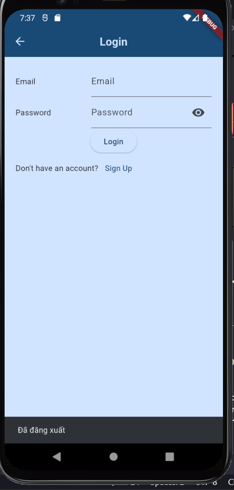
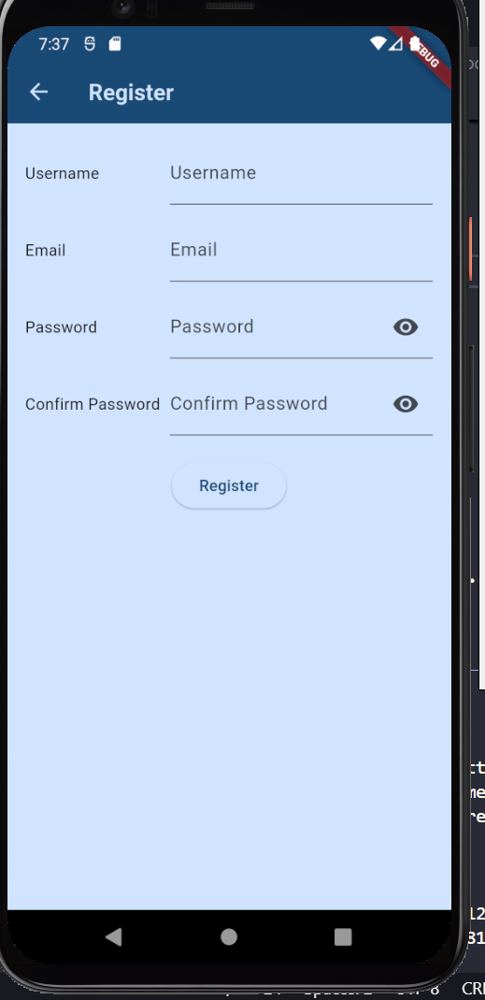
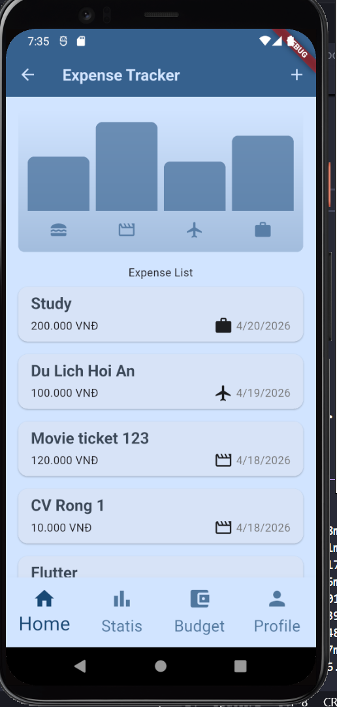
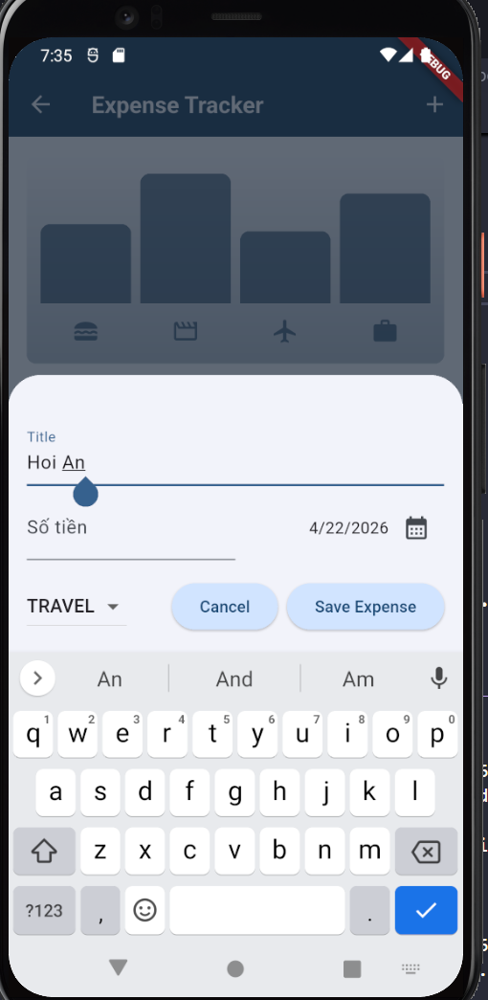
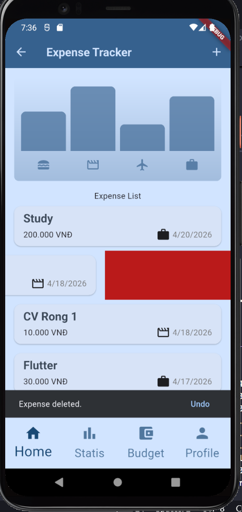
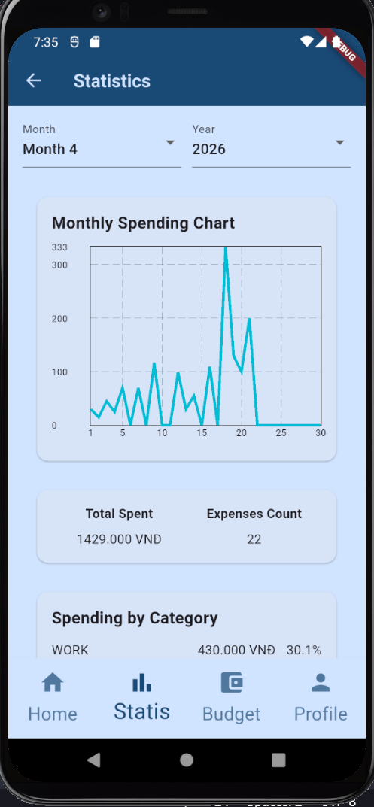

# Expense Tracker App \_ B23DCCN666

A full-stack expense tracking mobile app built with Flutter, Node.js, Express, and MySQL.

## Features

- Secure user authentication with registration, login, and logout
- Full expense management flow: add, edit, delete, and undo delete
- Organized expense tracking with title, amount, category, and transaction date
- Monthly analytics spending chart - Top 3 largest expenses
- Spending breakdown by category with percentage of monthly total
- Budget overview to monitor spending habits
- Profile screen for basic account information

## Demo Preview


## Tech Stack

- Flutter
- Dart
- Node.js
- Express.js
- MySQL

## Screenshots

<table>
  <tr>
    <td align="center">
      <br/>
      <sub>Login</sub>
    </td>
    <td align="center">
      <br/>
      <sub>Register</sub>
    </td>
    <td align="center">
      <br/>
      <sub>Home</sub>
    </td>
  </tr>
  <tr>
    <td align="center">
      <br/>
      <sub>Add Expense</sub>
    </td>
    <td align="center">
      <br/>
      <sub>Undo Delete</sub>
    </td>
    <td align="center">
      <br/>
      <sub>Statistics</sub>
    </td>
  </tr>
</table>

## Project Structure

- `lib/` – Flutter frontend
- `backend/` – Node.js backend

### Frontend

```bash
flutter pub get
flutter run
```

### Backend

```bash
npm install
npm start
```
